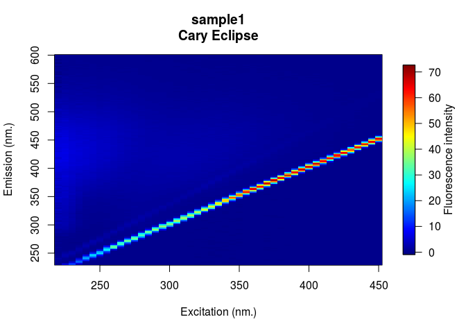
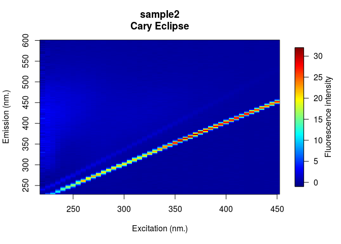

<!-- README.md is generated from README.Rmd. Please edit that file -->
| **OS**      | **Build status**                                                                                                                                                         |
|-------------|--------------------------------------------------------------------------------------------------------------------------------------------------------------------------|
| Linux & Mac | [](https://travis-ci.org/PMassicotte/eemR)                                            |
| Windows     | [](https://ci.appveyor.com/project/PMassicotte/eemR) |

EEM (excitation-emission fluorescence matrix)
=============================================

The **eemR** package implements various functions used calculate metrics from excitation-emission matrix (EEM) as well as to preform pre-processing corrections before PARAFAC analysis (Bro 1997; C. A. Stedmon and Markager 2005; Murphy et al. 2013). All functions from this package start with the `eem_` prefix. Please note this is a very alpha version of the package for testing purpose only.

``` r
library(eemR)
ls("package:eemR")
#> [1] "eem_coble_peaks"         "eem_export_matlab"      
#> [3] "eem_fluorescence_index"  "eem_raman_normalisation"
#> [5] "eem_read"                "eem_remove_blank"       
#> [7] "eem_remove_scattering"
```

Reading EEMs
============

At the moment, only EEM csv files produced by Cary Eclipse are supported. EEM can be read using the `eem_read()` function. *Please fill an [issue](https://github.com/PMassicotte/eemR/issues) if you have other file formats you would like to add to the package*.

``` r

library(eemR)

## Reading a single eem
file <- system.file("extdata/eem", "sample1.csv", package = "eemR")
eem <- eem_read(file)

plot(eem)

## Reading a folder

folder <- system.file("extdata/eem", package = "eemR")
eem <- eem_read(folder)

plot(eem) ## Plot the first eem
```



``` r
plot(eem, which = 2) ## Plot the second eem
```



Implemented metrics
===================

The current implemented metrics are:

1.  The fluorescence index (FI) developed by McKnight et al. (2001).
2.  The fluorescence peaks proposed by Coble (1996).

``` r

library(eemR)

file <- system.file("extdata/eem", "sample1.csv", package = "eemR")
eem <- eem_read(file)

eem_fluorescence_index(eem)
#>        sample       fi
#> 1 sample1.csv 1.264782

eem_coble_peaks(eem)
#>        sample        b        t        a        m        c
#> 1 sample1.csv 1.545298 1.060331 3.731836 2.459364 1.815422

folder <- system.file("extdata/eem", package = "eemR")
eem <- eem_read(folder)

eem_fluorescence_index(eem)
#> Source: local data frame [3 x 2]
#> 
#>        sample       fi
#>         (chr)    (dbl)
#> 1 sample1.csv 1.264782
#> 2 sample2.csv 1.455333
#> 3 sample3.csv 1.329413

eem_coble_peaks(eem)
#> Source: local data frame [3 x 6]
#> 
#>        sample        b         t        a        m         c
#>         (chr)    (dbl)     (dbl)    (dbl)    (dbl)     (dbl)
#> 1 sample1.csv 1.545298 1.0603312 3.731836 2.459364 1.8154222
#> 2 sample2.csv 1.262997 0.6647042 1.584842 1.067836 0.7729534
#> 3 sample3.csv 1.474086 1.3162812 8.416034 6.084682 6.3361907
```

PARAFAC pre-processing
======================

Three types of correction are currently supported:

1.  `eem_remove_blank()` which subtract a water blank from the eem.

2.  `eem_remove_scattering()` which remove both *Raman* and *Rayleigh* scattering.

3.  `eem_raman_normalisation()` which normalize EEM fluoresence intensities (Lawaetz and Stedmon 2009).

4.  `eem_inner_filter()` which correct for both primary and secondary inner-filter effect (Ohno 2002). **TODO \#1**

Removing Raman and Rayleigh scattering (1st and 2nd order)
----------------------------------------------------------

The `eem_remove_scattering()` function removes both Raman and Rayleigh scattering from EEMs.

``` r

file <- system.file("extdata/eem", "sample1.csv", package = "eemR")
eem <- eem_read(file)

res <- eem_remove_scattering(eem = eem, type = "raman", order = 1, width = 10)
res <- eem_remove_scattering(eem = res, type = "rayleigh", order = 1, width = 10)

plot(eem)
plot(res)
```


Blank removal
-------------

The `eem_remove_blank()` function subtract blank (miliq) water from eem. Scatter bands can often be reduced by subtracting water blank (Murphy et al. 2013).

``` r

file <- system.file("extdata", "nano.csv", package = "eemR")
blank <- eem_read(file)

res <- eem_remove_blank(res, blank)

plot(res)
```


Raman normalization
-------------------

The `eem_raman_normalisation()` function implement a simple calibration method for fluorescence intensity using only the integrated area of a water Raman peak. More details can be found in Lawaetz and Stedmon (2009).

``` r

res <- eem_raman_normalisation(res, blank)
#> Raman area: 9.514551

plot(res)
```


Export to Matlab
----------------

PARAFAC analysis was made easy with the fantastic Matlab [`drEEM`](http://www.models.life.ku.dk/drEEM) toolbox (Murphy et al. 2013). The function `eem_export_matlab()` can be used to export the EEMs into a `m-file` directly usable in Matlab by the `drEEM` toolbox.

``` r
folder <- system.file("extdata/eem", package = "eemR")
eem <- eem_read(folder)

filename <- paste(tempfile(), ".mat", sep = "")

eem_export_matlab(filename, eem)
#> Sucesfully exported 3 EEMs to /tmp/RtmpBjetyX/file13b0167dd45a.mat.
```

Note that the name of the structure generated by the function will be `OriginalData` to *complement* with PARAFAC standard. Then, the importation into Matlab is made easy using the `load()` function.

``` matlab
load('FileName.mat')
```

References
==========

Bro, Rasmus. 1997. “PARAFAC. Tutorial and applications.” *Chemometrics and Intelligent Laboratory Systems* 38 (2): 149–71. [doi:10.1016/S0169-7439(97)00032-4](http://doi.org/10.1016/S0169-7439(97)00032-4).

Coble, Paula G. 1996. “Characterization of marine and terrestrial DOM in seawater using excitation-emission matrix spectroscopy.” *Marine Chemistry* 51 (4): 325–46. [doi:10.1016/0304-4203(95)00062-3](http://doi.org/10.1016/0304-4203(95)00062-3).

Lawaetz, A J, and C A Stedmon. 2009. “Fluorescence Intensity Calibration Using the Raman Scatter Peak of Water.” *Applied Spectroscopy* 63 (8): 936–40. [doi:10.1366/000370209788964548](http://doi.org/10.1366/000370209788964548).

McKnight, Diane M., Elizabeth W. Boyer, Paul K. Westerhoff, Peter T. Doran, Thomas Kulbe, and Dale T. Andersen. 2001. “Spectrofluorometric characterization of dissolved organic matter for indication of precursor organic material and aromaticity.” *Limnology and Oceanography* 46 (1). American Society of Limnology; Oceanography: 38–48. [doi:10.4319/lo.2001.46.1.0038](http://doi.org/10.4319/lo.2001.46.1.0038).

Murphy, Kathleen R., Colin a. Stedmon, Daniel Graeber, and Rasmus Bro. 2013. “Fluorescence spectroscopy and multi-way techniques. PARAFAC.” *Analytical Methods* 5 (23): 6557. [doi:10.1039/c3ay41160e](http://doi.org/10.1039/c3ay41160e).

Ohno, Tsutomu. 2002. “Fluorescence Inner-Filtering Correction for Determining the Humification Index of Dissolved Organic Matter.” *Environmental Science & Technology* 36 (4): 742–46. [doi:10.1021/es0155276](http://doi.org/10.1021/es0155276).

Stedmon, Colin A, and Stiig Markager. 2005. “Resolving the variability in dissolved organic matter fluorescence in a temperate estuary and its catchment using PARAFAC analysis.” *Limnology and Oceanography* 50 (2): 686–97. [doi:10.4319/lo.2005.50.2.0686](http://doi.org/10.4319/lo.2005.50.2.0686).
